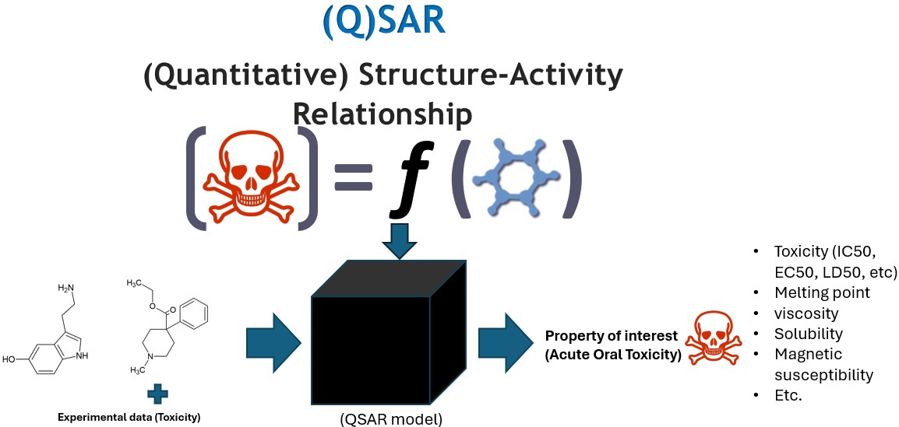

# QSAR Tutorial for Beginners

This repository contains a beginner-friendly tutorial for learning **Quantitative Structure–Activity Relationship (QSAR)** modeling. It is designed for undergraduate summer research students or new researchers who have little or no background in QSAR, cheminformatics, or machine learning.

The tutorial includes a written PDF/manual and a set of Jupyter notebooks. The PDF/manual explains the concepts, while the notebooks provide hands-on Python examples that students can run and modify.

## Recommended Way to Use This Tutorial

Students are encouraged to run the notebooks in **Google Colab** because it avoids most local installation issues and allows the code to run directly in a browser.

For the best learning experience:

1. **Read the corresponding chapter in the PDF/manual first.**  
   The manual explains the background, terminology, and purpose of each step.

2. **Open the matching notebook in Google Colab.**  
   Each notebook corresponds to one tutorial chapter.

3. **Install the required packages at the beginning of the Colab session.**  
   Run the installation command shown below.

4. **Run the notebook step by step.**  
   Try to understand what each code cell is doing before moving to the next one.

5. **Modify the examples.**  
   Change SMILES strings, descriptor lists, models, or plotting options to see how the results change.

6. **Use the notebooks as practice material.**  
   The goal is not only to run the code, but to understand how each part of a QSAR workflow works.

## Opening the Notebooks in Google Colab

Students do not need to install anything on their own computers. The recommended way to use this tutorial is to open each notebook directly in **Google Colab** and run the code there.

To use a notebook:

1. Open the notebook from the GitHub repository.
2. Click **Open in Colab** or copy the notebook link into Google Colab.
3. Run the notebook cells in order.

Google Colab already includes many commonly used Python packages. Any additional package setup needed for a specific notebook will be included inside that notebook.

For best results, read the corresponding chapter in the PDF/manual first, then open the matching notebook in Colab and run the code step by step.

## What Students Will Learn

By completing this tutorial, students should be able to:

- understand the basic idea of QSAR modeling,
- work with molecular structures using SMILES strings,
- use RDKit to visualize molecules and calculate descriptors,
- understand molecular descriptors and fingerprints,
- clean QSAR datasets before modeling,
- split data into training and test sets,
- train simple regression and classification models,
- evaluate models using common statistical metrics,
- understand internal and external validation,
- define and interpret applicability domain,
- explain QSAR models using feature importance, SHAP, and ALE-style interpretation.

## Folder Structure

- `data/`: shared example QSAR dataset
- `00_how_to_use/`: environment and data check
- `01_what_is_qsar/`: introduction to QSAR and dataset exploration
- `02_statistics_metrics/`: mean, variance, standard deviation, MAE, RMSE, and R²
- `03_basic_chemistry_for_qsar/`: SMILES notation and RDKit visualization
- `04_molecular_descriptors_and_fingerprints/`: RDKit descriptors and Morgan fingerprints
- `05_data_cleaning_and_preprocessing/`: invalid SMILES removal, descriptor filtering, and train/test splitting
- `06_machine_learning_basics_for_qsar/`: regression, classification, overfitting, and feature selection
- `07_internal_and_external_validation/`: k-fold cross-validation, leave-one-out cross-validation, and external validation
- `08_applicability_domain/`: Williams plot and similarity-based applicability domain
- `09_interpreting_and_explaining_a_qsar_model/`: feature importance, SHAP, and ALE-style interpretation
- `10_example_dataset_template/`: example dataset format
- `11_suggested_student_report_template/`: student report template
- `12_useful_resources/`: package checks and useful links

## Suggested Learning Path

Students should go through the material in order:

1. Read the PDF/manual chapter.
2. Open the corresponding notebook in Google Colab.
3. Install the requirements if needed.
4. Run the notebook step by step.
5. Complete the exercises or modify the code.
6. Move to the next chapter.

This order is recommended because later chapters build on concepts from earlier chapters. For example, model validation and interpretation are easier to understand after learning about descriptors, preprocessing, and basic machine learning.

## Optional Local Setup

Google Colab is recommended for beginners, but users who prefer running the notebooks locally can create a Python environment and install the same requirements file:

```bash
conda create -n qsar_tutorial python=3.10
conda activate qsar_tutorial
pip install -r requirements.txt
jupyter lab
```

## Final Goal

At the end of the tutorial, students should be able to complete a small QSAR project, including:

- loading and cleaning a molecular dataset,
- calculating descriptors or fingerprints,
- training a machine-learning model,
- evaluating model performance,
- checking applicability domain,
- interpreting important descriptors,
- presenting the results clearly.
